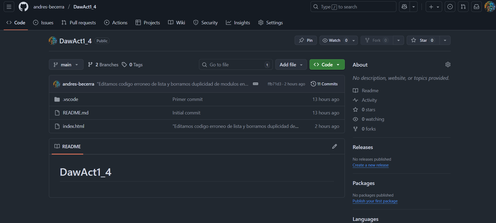

# DawAct1_4
Este es un repositorio de la Practica 1.3, trabajando repositorio remoto con GitHub de Despliegue de aplicaciones web, módulo de *DAW* donde aprendimos a crear un *repositorio remoto en GitHub* y sincronizarlo con nuestro local.

## Objetivos de la Practica 1.3
- Crear un repositorio remoto en GitHub
- Conectar el repositorio local con el remoto
- Aprender a subir cambios usando **commit** y **push**
- Gestionar archivos y carpetas desde GitHub

## Recursos
Podemos visitar la [documentación oficial de GitHub](https://docs.github.com/es) para aprender más sobre repositorios remotos

### Imagen de ejemplo
Aquí puedes ver un ejemplo de cómo se ve el repositorio remoto en GitHub:



### Bloque de código
```bash
# Comandos básicos para sincronizar un repositorio remoto
git init
git add README.md
git commit -m "Primer commit"
git branch -M main
git remote add origin https://github.com/andres-becerra/DawAct1_4.git 
git push -u origin main
```